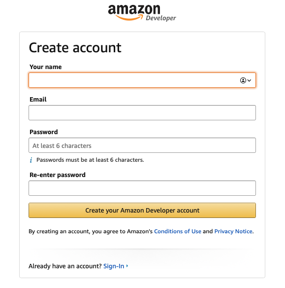

# Lab 1: ASK CLI Setup Guide

## **[Amazon Developer Account](./01-amzn-developer-account.md)** | [Tools](./02-tools.md) | [ASK CLI](./03-ask-cli.md) | [AWS Account](./04-aws-account.md)

## Create a New Amazon Developer Account

Alexa Skills are managed through an **Amazon Developer Account**.

> **Note:** Amazon Developer Portal is not the same as Amazon AWS and the accounts are different, although you may share the same e-mail address!

You must create an Amazon Developer account in order to create and publish skills for Alexa.

If you already have an Amazon.com account but not an Amazon developer account, you can optionally sign in with your Amazon.com account. On the backend, the Developer Console will create a developer account using your Amazon.com email address, and then the two accounts will be tied together and synced. You will be prompted to complete the registration profile pages in the Developer Console.

In fact, if you already have an Amazon account that your Alexa-enabled devices are registered to, it is recommended to createa an Amazon Developer Account registered to the same email address as your Amazon account. This way, skills you develop in your Developer Account automatically become available for testing on your own Alexa-enabled devices.

#### To create a new Amazon Developer account:

1. Go to https://developer.amazon.com/
1. Click **Sign In** in the upper-right corner
1. Click **Create your Amazon Developer account**

4. Complete the requested fields for your name, email, and password, and then click **Create your Amazon Developer account**

5. **Sign-In** with your new account (You can always sign in to the Developer Console by clicking **Sign In** in the upper-right corner)

After you sign in, you'll be prompted to complete information on 2 tabs, as shown below. (After you complete this information, you can update it at any time by logging into the Developer Console and going to **Settings**)

After you have completed the 2 step registration, you can navigate to the Alexa Skills Kit Console:

#### https://developer.amazon.com/alexa/console/ask

The Alexa Skills Kit developer console is where you can manage all your skills.

---

## Next Step: [Development Tools Setup](./02-tools.md)