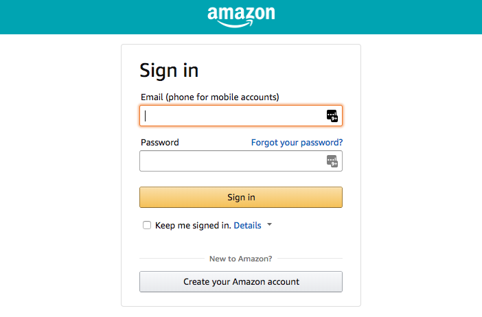
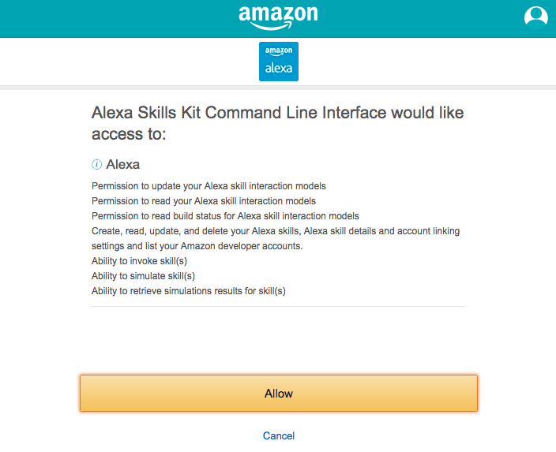

# Lab 1: ASK CLI Setup Guide

## [Amazon Developer Account](./01-amzn-developer-account.md) | [Tools](./02-tools.md) | **[ASK CLI](./03-ask-cli.md)** | [AWS Account](./04-aws-account.md)

## ASK CLI Initialization

If you are here it means that you have:

✓ **An Amazon Developer Account** (if not, follow the guide to [Create a new Amazon Developer Account](./01-amzn-developer-account.md))

✓ **The Development Tools installed** (if not, follow the guide to [Setup Development Tools](./02-tools.md))

✓ **The ASK CLI installed** (if not, follow the guide to [install ASK CLI](./03-ask-cli-install.md))


The first time you use ASK CLI, you must call the `init` command to initialize ASK CLI with your Amazon Developer account credentials. Once the initialization is complete, you can use ASK CLI to manage your skill. For more information, see [init command](https://developer.amazon.com/docs/smapi/ask-cli-command-reference.html#init-command).

On the Terminal, execute the following command:

```
$ ask init
```

> **Note**: By default, the ASK CLI will attempt to configure a name-less default profile for you. If you want to configure a named profile, you can use the `ask init --profile <profile_name>` command.

#### 1- Login With Amazon

This command will open your default browser to enter your Amazon Developer account credentials and map your account with the ASK CLI.

```
This command will initialize the ASK CLI with a profile associated with your Amazon developer credentials.
------------------------- Step 1 of 2 : ASK CLI Initialization -------------------------
Switch to "Login with Amazon" page and sign-in with your Amazon developer credentials.
If your browser did not open the page, run the initialization process again with command "ask init --no-browser".
    Listening on http://localhost:9090...
```



> **Note:**  If you're on a computer without a browser installed, you can use the `ask init --no-browser` command to complete initialization.  ASK CLI displays a URL that you can use to sign in with your Amazon developer account by using a web browser on a different computer. After you sign in, the browser displays a code that you can enter at the command line to complete the configuration of your credentials.

#### 2- Authorize Alexa Skills Kit CLI to access your account

Once you've entered your credentials, you will see an authorization screen to allow the ASK CLI to access your account:



#### 3- Select an AWS Profile

For this step, we will skip to associated an AWS account with the ASK CLI. An AWS Account is not needed when creating an [Alexa-Hosted](https://developer.amazon.com/docs/hosted-skills/build-a-skill-end-to-end-using-an-alexa-hosted-skill.html) skill. 

```
ASK Profile "default" was successfully created. The details are recorded in ask-cli config ($HOME/.ask/cli_config).
Vendor ID set as XXXXXXXXXXXXXX.


------------------------- Step 2 of 2 : Associate an AWS Profile with ASK CLI -------------------------
? If you want to host your skill's backend code in AWS Lambda (recommended)
, you must associate an AWS profile with the ASK CLI. Do you want to associ
ate an AWS profile? (Y/n) n
```

#### 4- Confirmation

```
------------------------- Skipping the AWS profile association -------------------------
You will only be able to deploy your Alexa skill. To set up AWS credentials later, use the "ask init --aws-setup" command.

------------------------- Initialization Complete -------------------------
Here is the summary for the profile setup: 
  ASK Profile: default
  No AWS profile linked to profile "default"
  Vendor ID: XXXXXXXXXXXXXX


```

### 🏆 Congratulations - You Have Completed the AWS CLI Setup! 🏆
---

## Next Step: [Create a new AWS Account](./04-aws-account.md)
