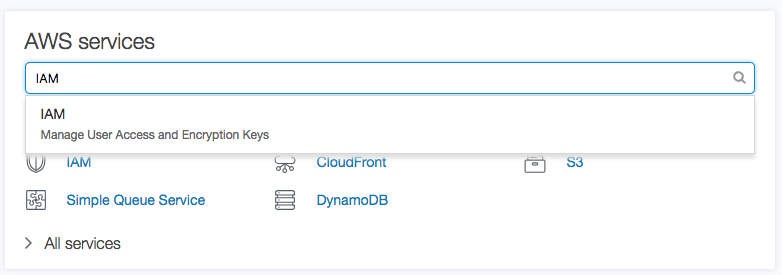
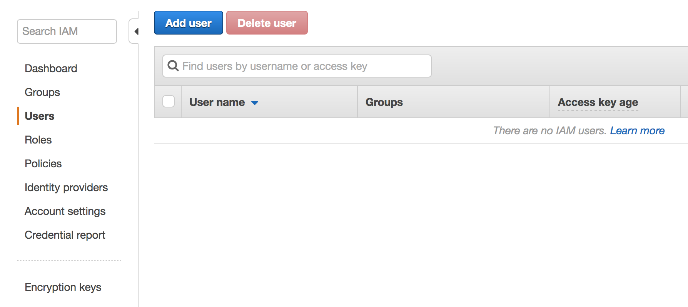
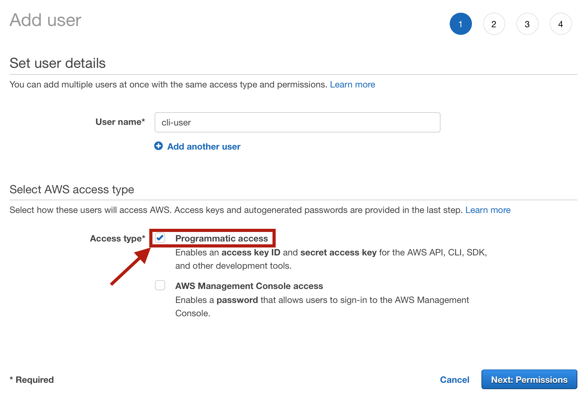
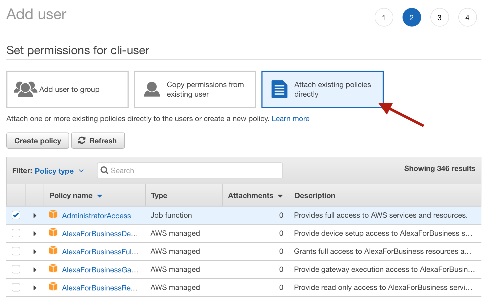
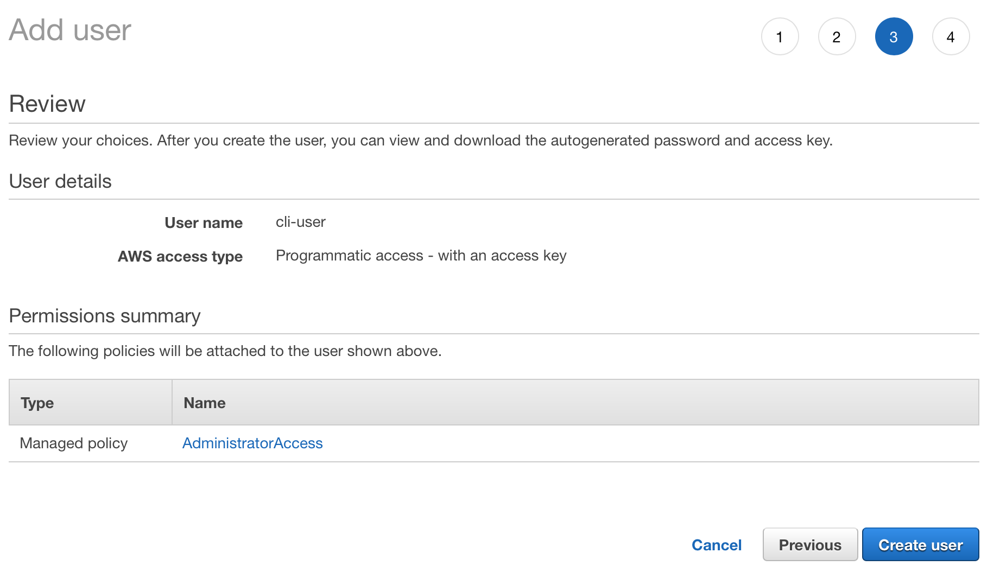
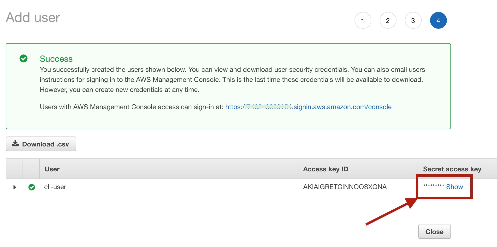

# Lab 1: ASK CLI Setup Guide

## [Amazon Developer Account](./01-amzn-developer-account.md) | [Tools](./02-tools.md) | [ASK CLI](./03-ask-cli.md) | **[AWS Account](./04-aws-account.md)**

## AWS Profile Setup

If you are here it means that you have:

✓ **An Amazon Developer Account** (if not, follow the guide to [Create a new Amazon Developer Account](./01-amzn-developer-account.md))

✓ **The Development Tools installed** (if not, follow the guide to [Setup Development Tools](./02-tools.md))

✓ **The ASK CLI installed** (if not, follow the guide to [install ASK CLI](./03-ask-cli-install.md))

✓ **An AWS Account** (if not, follow the guide to [Create a new AWS Account](./04-aws-account.md))

In this step, we will create a new AWS Identity and Access Management (IAM) User in your AWS account and a new AWS Profile mapped to this IAM user.

[IAM](https://aws.amazon.com/iam/) enables you to manage access to AWS services and resources securely. Using IAM, you can create and manage AWS users and groups, and use permissions to allow and deny their access to AWS resources.

IAM users enable programmatic access to your AWS Account so that tools such as the ASK CLI can access your account on your behalf, without requiring a username and password. Programmatic access to your account is controlled through an Access Key and an Access Secret Key.

### Create a New IAM User

#### 1- Log on to your AWS Account

Using your browser, navigate to: http://aws.amazon.com and log in to your account.

> **Note:** If you have already created IAM users in the past, make sure to log into your account with an IAM user that has sufficient privileges to create IAM users. Otherwise, if you are following along or have just created your AWS Account, use the email address and root account password associated with your AWS account, which has Administrator privileges to the account.


#### 2- In your AWS Account, navigate to the IAM Console

After you log on to the account, on the front page, type `IAM` in the AWS services search box and select `IAM` from the drop-down that appears.



#### 3- Open the Users Panel and `Add user` to create a new IAM User

From the menu on the left-hand side, click `Users` and then, from the Users list view, click the `Add user` button at the top of the page to start the step-by-step wizard for creating a new IAM user. 



#### 4- Name the User and Give it Programmatic Access

The first step for creating a new user is to give the user a name and to decide what type of access the user will have. In our case, the user will need to have **programmatic access** so make sure to select that check box. This user will not need AWS Management Console access so leave that check box unselected.



#### 5- Configure Security Policy for the New User

The next step in the processs is to determine the permissions associated with the IAM user. This controls what features of your AWS account to which the IAM user has access. Select **Attach existing policies directly** and give the user **Administrator Access**.



#### 6- Review User Configuration and Create User

The next step is just an overview of the new user you are about to create. Confirm that the user has **programmatic access** and that the correct Permissions were associated.



#### 7- Record the new User Access Key ID and Secret Access Key

**IMPORTANT** This is the only opportunity you have to view the secret access key associated with the newly created IAM user. Make note of both the **Access Key ID** and the **Secret Access Key** shown on this page.

For now, do not close this browser page until you have configured an AWS Profile on the ASK CLI using the access keys shown here.



### Configure a New AWS Profile for ASK CLI

To use AWS to host your skill's backend logic on AWS Lambda in your account, you need to map your IAM User to the ASK CLI using the **programmatic access credentials**. As we have already associated the ASK CLI to the Amazon Developer account, we only need to set up AWS credentials running the following command:

```
ask init --aws-setup
```

When prompt to provide a profile name, leave the entry empty and press enter

```
? Please provide a profile name or press enter to use ask_cli_default as the profile name:  (ask_cli_default)
```

Next, you will be prompt to enter your **Access Key ID** and the **Secret Access Key**:

```
Please follow the instruction from https://developer.amazon.com/docs/smapi/set-up-credentials-for-an-amazon-web-services-account.html
Fill in the AWS Access Key ID and AWS Secret Access Key below. CLI will generate/modify the AWS credential file for you.
? AWS Access Key ID:  ABCDBEFGHIGKLMNOPK
? AWS Secret Access Key:  examplea1B2cd345EFGH78xYZ
AWS profile "ask_cli_default" was successfully created. The details are recorded in aws credentials file ($HOME/.aws/credentials).
```

To confirm the AWS Profile has been correctly 

After creating the new profile you can verify that it was setup correctly by opening the `~/.aws/credentials` file:

```
more ~/.aws/credentials
```
The expected output should look like the following:

```
[ask_cli_default]
aws_access_key_id=ABCDBEFGHIGKLMNOPK
aws_secret_access_key=examplea1B2cd345EFGH78xYZ
```

---

### 🏆 Congratulations - You Have Completed the AWS Account Setup! 🏆